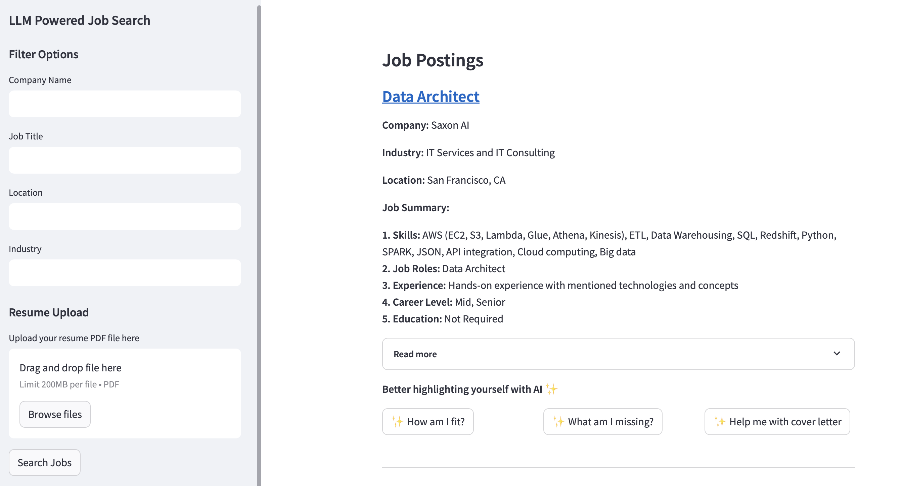
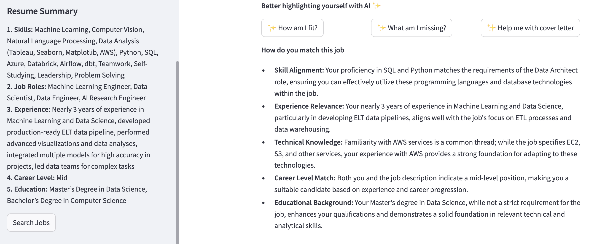

# A Simple LLM Power Job Search application

The project focuses on creating a web application designed to help users secure jobs where they stand out as top candidates based on their resumes. 

Key features include extracting essential details from users’ PDF resumes, gathering pertinent data from job postings on LinkedIn and other platforms, and aligning user resumes with the most suitable job opportunities, incorporating with other advanced features such as skill gaps recommendation or draft cover letter generation.

The goal is to assist users in pinpointing the best job matches that capitalize on their strengths and experience, boosting their employment prospects.



# Installation Guide

## 0. Install neccessary packages
In order to create a virtual environment with neccessary packages, please follow the following steps:

### 0.1. Create a conda environment:
```
conda create -n {your environment}
```

### 0.2. Activate the created environment:
```
conda activate {your environment}
```

### 0.3. Install neccessary packages:
```
pip install -r requirements.txt
```

## 1. Prepare neccessary files

### 1.1. Config file
An OpenAI API key is required to initialize the config file. To create a config file, run:
```
python create_config.py --api_key {YOUR API KEY}
```

### 1.2. Other files

You can either download the prepared files on [Google Drive](https://drive.google.com/file/d/1lGxQC2D3p6c8iPJZTl8Z_Ojix4-HJ2YI/view?usp=share_link) or do it manually with the following steps:

### Download Job Postings dataset
The LinkedIn job postings dataset can be download from [Kaggle](https://www.kaggle.com/datasets/arshkon/linkedin-job-postings). The dataset should be installed in a ```datasets``` folder.


### Generate Job dataset with necessary information

The dataset includes both posting details, company details and job summaries. To generate the dataset, run:
```
python gen_job_data.py --save_path {your save file path} --max_jobs {maximum jobs to save}
```
The default setting will save the generated file in ```.datasets/job_merged.csv```

### Create job embedding files
In order to generate the embedding files, run:
```
python gen_job_embeddings.py --save_dir {directory to save embedding files}
```
The script generates 2 files: ```job_embeds.faiss``` to store vector embeddings and ```id_mapping.json``` to map the embedding ids to job ids.

The default setting will save the generated files in ```.embeddings/```.

In final, the project structure should be as followed:

```
project_dir
    |__datasets/
    |       |__linkedin-jobs-2023-2024/
    |       |__job_merged.csv
    |
    |__prompts/
    |__embeddings/
    |       |__job_embeds.faiss
    |       |__id_mapping.json
    |__config.json
    |__ ...

```

## 3. Run the streamlit app
In order to run the streamlit app, run:
```
streamlit run app.py
```
# Streamlit Application

The application allows user to filter jobs based on certain options such as company name, job title or location. In additonally, user can also upload resume file in PDF format to search for the most suitable jobs based on their resume summary.

**Notes:** In order to upload a new resume file, please remove the current file first before uploading to avoid duplicating.